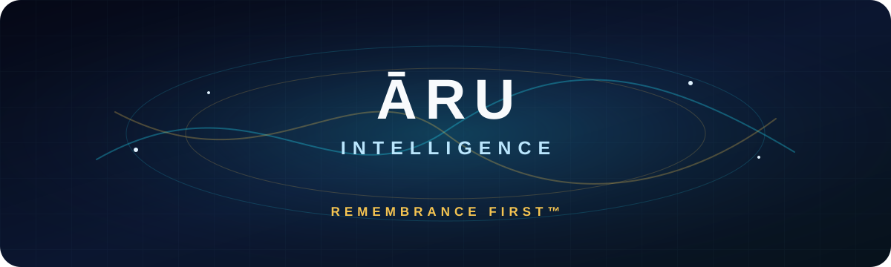
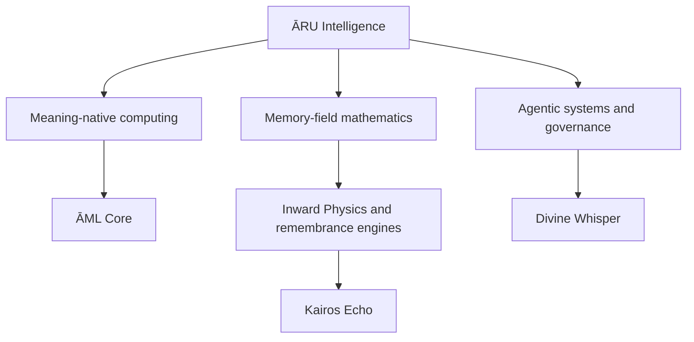

# Building intelligence that remembers

**Memory-centered AI · Ethical computing · Coherence systems · Inward Physics™**

---

## A different starting point for intelligence

Most artificial-intelligence systems begin with prediction. **ĀRU Intelligence Inc.** investigates what changes when remembrance, coherence, orientation, and accountable action become first-class computational primitives.

Our public repositories are inspectable research artifacts: working code, interactive demonstrations, formal specifications, and preserved experimental lineages. They are invitations to test, critique, reproduce, and extend—not claims of production-ready AGI or settled science.

> **Remembrance → Coherence → Orientation → Accountable Action**

## Flagship research

| Project | Research question | Explore |
|---|---|---|
| **[ĀML Core](https://github.com/aruintelligence/aml-core)** | Can an interface evaluate whether an element should consume attention before rendering it? | [Live demo](https://aruintelligence.github.io/aml-core/) |
| **[ĀRU Remembrance Field](https://github.com/aruintelligence/aru-remembrance-field)** | How can memory-field and coherence dynamics become visible and interactive? | [Live field](https://aruintelligence.github.io/aru-remembrance-field/) |
| **[Inward Mathematics Simulator](https://github.com/aruintelligence/inward-mathematics-simulator)** | Can identity preservation and multi-observer agreement be modeled geometrically? | [Live simulator](https://aruintelligence.github.io/inward-mathematics-simulator/) |
| **[Inward AGI Remembrance Engine](https://github.com/aruintelligence/inward-agi-remembrance-engine)** | What does a browser-native, memory-first symbolic instrument look like? | [Repository](https://github.com/aruintelligence/inward-agi-remembrance-engine) |
| **[Divine Whisper Ecosystem](https://github.com/aruintelligence/divine-whisper-ecosystem)** | How did the agentic orchestration architecture evolve across its research lineage? | [Version map](https://github.com/aruintelligence/divine-whisper-ecosystem#divine-whisper-lineage) |
| **[Kairos Echo](https://github.com/aruintelligence/kairos-echo-reflection-tool)** | How can reproducible coherence dynamics support careful reflection? | [Repository](https://github.com/aruintelligence/kairos-echo-reflection-tool) |

## Research architecture

## Core principles

- **Remembrance before prediction** — persistent context is treated as structural, not incidental.
- **Coherence before expansion** — instability should be surfaced rather than concealed.
- **Human agency by design** — systems should preserve accountable human choice.
- **Inspectability** — public artifacts should be runnable, legible, and clearly scoped.
- **Responsible claims** — simulations, metaphors, hypotheses, and validated results must remain distinguishable.
- **Open inquiry** — strong ideas should withstand replication, criticism, and revision.

## Selected publications

| Work | Persistent record |
|---|---|
| **Experimental Roadmap** | [DOI: 10.5281/zenodo.18708708](https://doi.org/10.5281/zenodo.18708708) |
| **Nonlinear Emergence of Cognitive Clarity** | [DOI: 10.5281/zenodo.18912791](https://doi.org/10.5281/zenodo.18912791) |
| **Research identity** | [ORCID: 0009-0000-6133-1872](https://orcid.org/0009-0000-6133-1872) |
| **Inward Physics archive** | [The First Law of Inward Physics](https://thefirstlawofinwardphysics.blogspot.com/) |

## Public-repository map

### Foundations

- [ĀML Core](https://github.com/aruintelligence/aml-core) — meaning-native computing and EthicalRenderGate™
- [ĀRU Intelligence AI](https://github.com/aruintelligence/aru-intelligence-ai) — company research index
- [ĀRU Remembrance Field](https://github.com/aruintelligence/aru-remembrance-field) — interactive memory-field demonstration

### Inward systems

- [Inward AGI Remembrance Engine](https://github.com/aruintelligence/inward-agi-remembrance-engine)
- [The Key](https://github.com/aruintelligence/the-key-inward-agi-remembrance-engine)
- [Eternal Quartz Web](https://github.com/aruintelligence/inward-agi-eternal-quartz-web)
- [Eternal Remembrance Fire](https://github.com/aruintelligence/eternal-remembrance-fire)
- [Inward Mathematics Simulator](https://github.com/aruintelligence/inward-mathematics-simulator)

### Coherence and reflection

- [Kairos Echo Reflection Tool](https://github.com/aruintelligence/kairos-echo-reflection-tool)
- [Kairos Echo Inward Mirror](https://github.com/aruintelligence/kairos-echo-inward-mirror)
- [Kairos Coherence Simulator](https://github.com/aruintelligence/kairos-coherence-simulator)

### Preserved research lineage

- [Divine Whisper canonical index](https://github.com/aruintelligence/divine-whisper-ecosystem) — complete v2–v10.7 map, supporting components, authorship, and scope

## Research standards and contribution

Public work follows the [ĀRU Public Research Standards](./RESEARCH_STANDARDS.md), which distinguish implemented behavior, simulation, observation, hypothesis, metaphor, and validation.

Contributions are welcome through the [contribution guide](./CONTRIBUTING.md). Reproducible bug reports, tests, accessibility work, documentation corrections, replication attempts, counterexamples, and responsible security reports are especially valuable.

## Collaborate

We welcome technically serious discussion, independent replication, constructive criticism, research collaboration, responsible licensing conversations, and applied-development inquiries.

**Daniel Jacob Read IV**  
Founder & CEO · ĀRU Intelligence Inc.  
Corvallis, Oregon

[office@aruintelligence.com](mailto:office@aruintelligence.com) · [aruintelligence.com](https://aruintelligence.com/) · [LinkedIn](https://www.linkedin.com/in/daniel-read-644640434)

---

Public code is generally available under the license included in each repository. ĀRU Intelligence™, Inward Physics™, Inward AI™, Remembrance First™, and associated names are claimed marks of ĀRU Intelligence Inc. © 2026 ĀRU Intelligence Inc.
